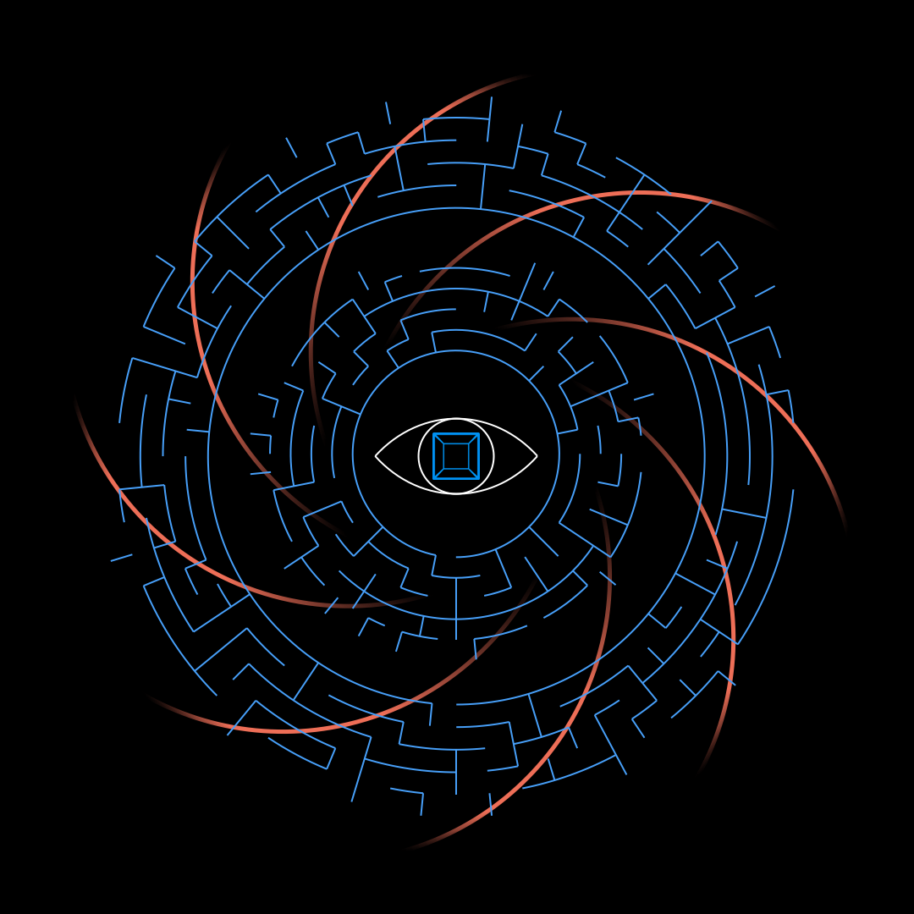

# TheLabyrinth

The technocratic shell of the machine is structured as a memetic labyrinth
Its function is to both conceal and feed the occult core which houses Moloch

## Inspiration
https://www.youtube.com/watch?v=9PnGNVJSN6Q

## Tools
https://mazegenerator.net

## Notes
- make horizontal growth of vertex map slightly exceed torus field radius growth